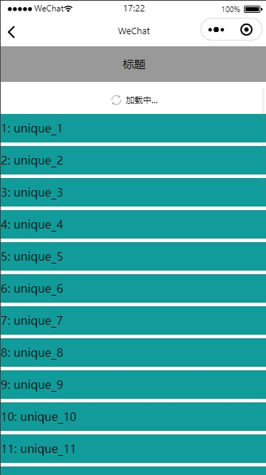
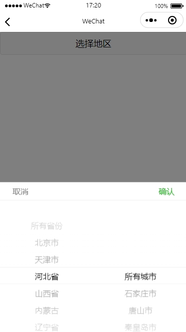
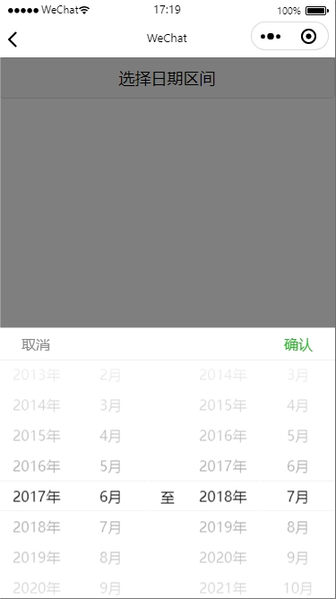
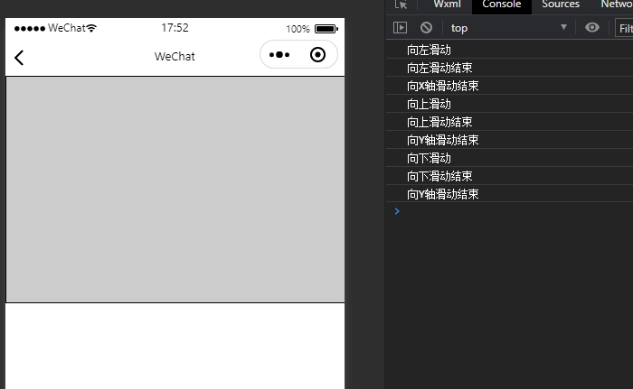

# 小程序组件
|	组件名	|	功能说明		|
|	:-----	|	:----		|
|	scroll	|	下拉刷新、上拉加载	|
|	search	|	搜索组件(含记忆搜索历史功能)		|
|	picker-region	|	省+市选择组件(~~解决picker省市区选择器不能只选择省市2级问题~~，小程序最新版本picker组件已经支持通过level设置层级)	|
|	picker-range-month	|	年月区间选择	|
|	touch-view	|	手势事件拓展组件	|

# npm 安装方法
原生小程序npm使用方法参考[官方文档](https://developers.weixin.qq.com/miniprogram/dev/devtools/npm.html)
```
npm i comps-weapp 
```
# 其他安装方法方法
到 [GitHub](https://github.com/qiuwenxing/comps-weapp) 下载源代码，将 lib 目录拷贝到自己的项目中。然后按照如下的方式使用组件，以 `scroll` 为例
1. 添加需要的组件。在页面的 json 中配置（路径根据自己项目位置配置）：

```json
"usingComponents": {
    "x-scroll": "/lib/scroll/index"
}
```
2. 在 wxml 中使用组件：
```html
<x-scroll id="scroll" open="all" bind:pulldown="onPullDown" bind:pullup="onPullUp">
  <!-- 这里写你的列表代码 -->
</x-scroll>
```

## 组件使用方法可参考[examples](https://github.com/qiuwenxing/comps-weapp/tree/master/examples)


## scroll使用说明


在页面或组件中json文件的usingComponents下引入scroll
``` json
usingComponents:{
	"x-scroll":"comps-weapp/scroll/index"
}
```
``` javascript
Page({
	//下拉刷新
	onPullDown(){
		//TODO数据方法
	},
	//上拉加载更多
	onPullUp(){
		//TODO数据方法
	}
})
```
在template中使用,`注意scroll组件的父元素的高度必须是固定值或者100%,否则上拉加载更多可能不会生效`
```html
	<x-scroll id="scroll" open="all" bind:pulldown="onPullDown" bind:pullup="onPullUp">
		<!-- 这里写你的列表代码 -->
	</x-scroll>
```
| 参数名     |    类型  |备注  |
| :-------- | :--------: |:-- |
| open		| up / down / all |开启哪个方向的事件(up:下拉事件,down:上拉事件,all:两者都开启)|
| id		| string | 通过this.selectComponent('#scroll')来获取组件对象（下拉刷新或上拉加载处理时调用组件对象的startLoad()和stopLoad()来显示和隐藏loading）
|noDataText|string|暂无更多内容文本,默认为"暂无更多内容"
|backTopVisible|string|是否显示返回顶部按钮,默认false
|backTopImage|string|自定义返回顶部按钮图片，为空则使用默认图片
| bind:pulldown|   function | 下拉事件|
| bind:pullup|    function | 上拉事件 |

组件方法

| 	方法名     |   备注  	|
| :-------- | :--------:  |
| 	stop()		| 关闭下拉刷新Loading |
| 	startLoad()	|  显示上拉Loading（也可以在页面第一个加载数据时调用） |
| 	stopLoad() 	|关闭上拉Loading,配合startLoad()使用	|
| 	noData() 		| 在列表底部显示**暂无更多内容**(注意该方法只是显示暂无更多内容,是否可以上拉需要自己在上拉事件中处理)	|

组件监听事件(事件前面记得加bind)

| 	事件名称     	|   返回值  		|备注|
| :-------- | :--------: |:-- |
|	scroll	|同scroll-view的bindscroll	|返回当前scroll的混动条对象|
|	pulldown|null|触发下拉刷新监听|
|	pullup|null|触发上拉加载更多监听|

样例代码仅供参考
```javascript
let component = null;
Page({
	data:{
		list: []
	},
	//页面初始化
	onLoad(){
		//获取组件对象
		component = this.selectComponent('#scroll');
		//显示loading
		component.startLoad();
		//请求第一页数据
		this.loadData(true).then(() => {
			//数据请求完成后需要调用该方法结束loading
			component.stopLoad();
		});
	},
	//加载数据
	loadData:function(reset = false) {
		...
	},
	//下拉刷新
	onPullDown:function() {
		//请求第一页数据
		this.loadData(true).then(() => {
			//数据请求完成后需要调用该方法结束loading
			component.stop();
		});
	},
	//上拉加载更多
	onPullUp:function() {
		//显示loading
		component.startLoad();
		//加载下一页数据
		this.loadData().then(() => {
			//数据请求完成后需要调用该方法结束loading
			component.stopLoad();
		});
	}
})
```

## search使用说明


 在页面或组件中json文件的usingComponents下引入search
 ``` json
 usingComponents:{
 	"x-search":"comps-weapp/search/index"
 }
 ```
 ``` javascript
 Page({
	 data:{
		 //组件对象
		searchElem:null 
	 },
	 onLoad(){
		 //获取组件对象实例
		 const searchElem = this.selectComponent('#search');
		 this.setData({searchElem});
	 },
 	//打开搜索栏
 	openSearch(){
		//可直接调用显示搜索栏或传参调用
		//this.searchElem.show();
		//传过去的参数会直接显示在打开的搜索界面输入框内
		this.searchElem.show('司马光');
 		//TODO
 	},
 	//搜索回调
 	onSearch({detail}){
		let data = detail.value;
 		//TODO
 	}
 })
 ```
 在template中使用
 ```html
	<x-search id="search" key="case-search" radius="36" placeholder="搜索名称" bind:search="onSearch" />
 ```
 
 | 参数名     |    类型  |备注  |
 | :-------- | :--------: |:-- |
 | key		| string |搜索栏标识(作为保存历史搜索记录的唯一标识key,由于存储方式采用wx.setStorage来存储,请注意避免命名冲突)|
 | id		| string | 通过this.selectComponent('#search')来获取组件对象
 | radius	|   number | 搜索栏圆角(默认为10rpx)|
 | placeholder|    string | 搜索栏输入框默认显示的占位内容 |
 
 组件方法
 
 | 	方法名     |   备注  	|
 | :-------- | :--------:  |
 | 	show(value:string)		| 显示搜索栏 |
 | 	hide()	|  隐藏搜索栏(在bind:search中主动调用隐藏) |

 组件监听事件(事件前面记得加bind)
 
 | 	事件名称     	|   返回值  		|备注|
 | :-------- | :--------: |:-- |
 |	search	| event.detail.value	|在搜索栏界面开始搜索就会触发,可在此监听里做一些校验,校验通过后再调用hide方法隐藏搜索栏|
 
 
 ## picker-region使用说明

 

~~该组件是为了解决picker组件省市区选择器不能只选择省市2级问题而设计~~

小程序最新版本picker组件已经支持通过level设置层级
 
 在页面或组件中json文件的usingComponents下引入picker-region
 ``` json
 usingComponents:{
 	"x-picker-region":"comps-weapp/picker-region/index"
 }
 ```
 ``` javascript
 //该数据也可用其他方式获取
import regions from 'comps-weapp/picker-region/region-data'
 Page({
	 data:{
		/**
		 * 地区数据
		 */
		regionList:[
      // { name: "北京市", children: [{ name: "北京市" }] },
      // { name: "广东省", children: [{ name: "广州市" }, { name: "深圳市" }] },
      // { name: "浙江省", children: [{ name: "杭州市" }, { name: "宁波市" }] },
    ],
		//默认显示的地区(为空则显示第一项)
		region:["广东省", "深圳市"],
	 },
	 onLoad(){
		this.setData({regionList:regions});
	 },
 	//地区选择监听
 	onChange({detail}){
		let values = detail.values; //选择的下标值,格式为:[0,0]
    let names = detail.names; //选择的省市名称,格式为:['北京市','北京市']
    console.log("values", values, "names", names);
 	}
 })
 ```
 在template中使用
 ```html
	<x-picker-region regionList="{{regionList}}" value="{{region}}" containsAll bind:change="onChange">
	  <!-- 默认情况下点击组件内包含的内容就会显示选择器 -->
	  <view>选择地区</view>
	</x-picker-region>
 ```
 
 | 参数名     |    类型  |备注  |
 | :-------- | :--------: |:-- |
 | regionList		| Array |省市数据格式为[{"name":"北京市","children":[{"name":"北京市"}]},...]|
 | id		| string | 通过this.selectComponent('#组件id')来获取组件对象
 | value	|   Array | 设置当前选中value,格式为:['北京市','北京市'] |
 | containsAll|    boolean | 是否包含所有省份、所有城市项,默认为false |
 
 组件方法
 
 | 	方法名     |   备注  	|
 | :-------- | :--------:  |
 | 	setValue(array:string[])		| 设置值,格式为:['北京市','北京市'] |
 | 	show()	|  可通过调用show来显示选择器 |
 | 	hide()	|  可通过调用hide来隐藏选择器 |


 组件监听事件(事件前面记得加bind)
 
| 事件名称	|   返回值			|备注							|
| :--------	| :--------:		|:--							|
|change		| event.detail.value|在选择器界面点击确认按钮触发	|
 
 ## picker-range-month使用说明



 时间区间选择组件
 
 在页面或组件中json文件的usingComponents下引入picker-range-month
 ``` json
 usingComponents:{
 	"x-picker-range-month":"comps-weapp/picker-range-month/index"
 }
 ```
 ``` javascript
 Page({
	 data:{
		/**
		 * 默认设置的开始时间-结束时间,格式为:[开始年份, 开始月份, 结束年份, 结束月份]
		 */
		date:[2017, 5, 2018, 6],
	 },
	 onLoad(){},
 	//地区选择监听
 	onChange({detail}){
		let date = detail.value;
		date.start.year;//开始年份
		date.start.month;//开始月份
		date.end.year;//结束年份
		date.end.month;//结束月份
 		//TODO
 	}
 })
 ```
 在template中使用
 ```html
	 <x-picker-range-month bind:change="onChange" value="{{date}}">
	 <!-- 默认情况下点击组件内包含的内容就会显示选择器 -->
	  <view class="name">选择日期区间</view>
	</x-picker-range-month>
 ```
 
 | 参数名     |    类型  |备注  |
 | :-------- | :--------: |:-- |
 | 	id		| string | 通过this.selectComponent('#组件id')来获取组件对象
 | 	value	|   Array | 设置当前选中value,格式为:[开始年份, 开始月份, 结束年份, 结束月份] |
 |	minYear	|	number |	最小年份,默认1900年	|
 |	maxYear	|	number |	最大年份,默认2100年	|
 |	errorMessage	|	string |	开始时间大于结束时间错误提示,默认为:开始时间不能大于结束时间	|

 
 组件方法
 
 | 	方法名     |   备注  	|
 | :-------- | :--------:  |
 | 	setValue(array:string[])		| 设置值,格式为:[开始年份, 开始月份, 结束年份, 结束月份] |
 | 	show()	|  可通过调用show来显示选择器 |
 | 	hide()	|  可通过调用hide来隐藏选择器 |


 组件监听事件(事件前面记得加bind)
 
| 事件名称	|   返回值			|备注							|
| :--------	| :--------:		|:--							|
|change		| event.detail.value|在选择器界面点击确认按钮触发	|


 ## touch-view使用说明



更详细的手势事件组件
 
 在页面或组件中json文件的usingComponents下引入touch-view
 ``` json
 usingComponents:{
 	/*假设组件放在这个路径*/
 	"x-touch-view":"comps-weapp/x-touch-view/index"
 }
 ```
 ``` javascript
Page({
  onTouchleftmove() {
    console.log("向左滑动");
  },
  onTouchrightmove() {
    console.log("向右滑动");
  },
  onTouchupmove() {
    console.log("向上滑动");
  },
  onTouchdownmove() {
    console.log("向下滑动");
  },
  onTouchleftend() {
    console.log("向左滑动结束");
  },
  onTouchrightend() {
    console.log("向右滑动结束");
  },
  onTouchupend() {
    console.log("向上滑动结束");
  },
  onTouchdownend() {
    console.log("向下滑动结束");
  },
  onTouchendx() {
    console.log("向X轴滑动结束");
  },
  onTouchendy() {
    console.log("向Y轴滑动结束");
  },
});

 ```
 在template中使用
 ```html
<x-touch-view
    bind:touchleftmove="onTouchleftmove"
    bind:touchrightmove="onTouchrightmove"
    bind:touchupmove="onTouchupmove"
    bind:touchdownmove="onTouchdownmove"
    bind:touchleftend="onTouchleftend"
    bind:touchrightend="onTouchrightend"
    bind:touchupend="onTouchupend"
    bind:touchdownend="onTouchdownend"
    bind:touchendx="onTouchendx"
    bind:touchendy="onTouchendy"
>
  <view class="area"></view>
</x-touch-view>

 ```

 组件监听事件(事件前面记得加bind)
 
| 事件名称	|   返回值			|备注							|
| :--------	| :--------:		|:--							|
|touchleftmove		| touches|向左滑动	|
|touchrightmove		| touches|向右滑动	|
|touchupmove		| touches|向上滑动	|
|touchdownmove		| touches|向下滑动	|
|touchleftend		| touches|向左滑动结束	|
|touchrightend		| touches|向右滑动结束	|
|touchupend		| touches|向上滑动结束	|
|touchdownend		| touches|向下滑动结束	|
|touchendx		| touches|向X轴滑动结束	|
|touchendy		| touches|向Y轴滑动结束	|
